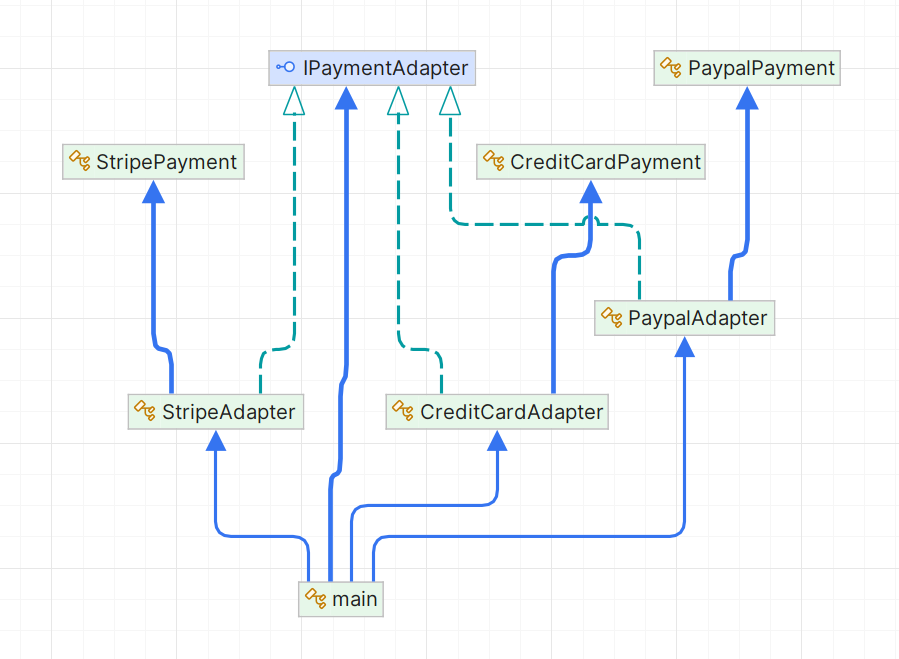

# Adapter Pattern

## 1. Problem Statement

In the modern world of online payments, there are many third-party services such as **Credit Card**, **PayPal**, and **Stripe** that offer different payment methods. Each service has its own way of processing payments, and often their APIs are not compatible with each other.

For example, one service may require a `cardNumber`, `expiryDate`, and `securityCode`, while another may only need an `email` for processing payments. In such cases, it would be inefficient and cumbersome to modify your codebase every time you want to add a new payment method.

The problem here is that different payment systems require different interfaces, making it difficult to integrate them in a consistent manner.

## 2. Why Adapter is Used Here

The **Adapter Pattern** is used to create a common interface (`IPaymentAdapter`) for all payment methods (Credit Card, PayPal, Stripe). The goal is to allow these different payment methods to be treated the same way by the client code, even though they have different interfaces.

Without the Adapter pattern, the client code would need to know the specifics of each payment method’s implementation and interact with each one using different methods and arguments. The Adapter pattern allows the system to work with different third-party services uniformly by adapting their unique interfaces to a common interface, reducing complexity and coupling in the code.

## UML Diagram

## 3. How Adapter is Implemented

In the Adapter Pattern, we have the following key elements:

- **Target Interface (`IPaymentAdapter`)**: This is the common interface that all adapters implement. It defines the method `ProcessPayment(double amount)`, which every adapter class will provide its implementation for.

- **Adaptee Classes**: These are the third-party classes with their own unique interfaces that need to be adapted. In this case, the `CreditCardPayment`, `PaypalPayment`, and `StripePayment` classes are the Adaptee classes, each with its own method for processing payments.

- **Adapter Classes (`CreditCardAdapter`, `PaypalAdapter`, `StripeAdapter`)**: These classes implement the target interface (`IPaymentAdapter`) and adapt the methods from the Adaptee classes. Each adapter class takes the parameters needed by the third-party service and internally calls the appropriate method on the Adaptee to process the payment.

- **Client Code**: The client code interacts with the payment system through the `IPaymentAdapter` interface, which allows it to process payments without needing to know the specific details of each third-party service. The client can simply use the common method `ProcessPayment`, and the appropriate adapter will handle the specifics of interacting with the third-party service.

## 4. What Benefits Adapter Provides Here More Than Using Direct Concrete Third Party

1. **Decoupling**:
    - The Adapter pattern decouples the client code from the specific implementation details of the third-party payment systems. The client code interacts only with the `IPaymentAdapter` interface, which allows for easier maintenance and future extension without modifying the client code.

2. **Code Reusability**:
    - The Adapter allows reusability by allowing the same interface (`IPaymentAdapter`) to be used across different payment methods. You can add new payment methods simply by creating a new adapter, without modifying the existing client code.

3. **Flexibility**:
    - If a new payment method needs to be added (say, Google Pay or Apple Pay), you can do so without affecting the existing code. You just need to implement a new adapter for the new payment method, which would integrate seamlessly with the existing client code.

4. **Consistency**:
    - With the Adapter pattern, you ensure that the client code interacts with all payment methods in a consistent manner, regardless of the underlying payment service. This leads to a simpler and more readable codebase.

5. **Simplified Client Code**:
    - Instead of having to deal with various methods and parameters for each payment service (e.g., different methods for PayPal, Credit Card, or Stripe), the client can simply call the `ProcessPayment` method on the adapter. This simplifies the logic and keeps the client code clean and easy to understand.

6. **Avoiding Repetitive Code**:
    - Without the Adapter pattern, the client would have to interact with each payment method individually, potentially leading to repetitive code for handling each type of payment. The Adapter pattern reduces this redundancy by centralizing the logic of each payment method in a single adapter class.

### Conclusion

The **Adapter Pattern** helps to standardize different interfaces under a common interface, making it easier for the client code to interact with various third-party services. It reduces complexity, promotes reusability, and ensures that your code remains flexible and maintainable.
