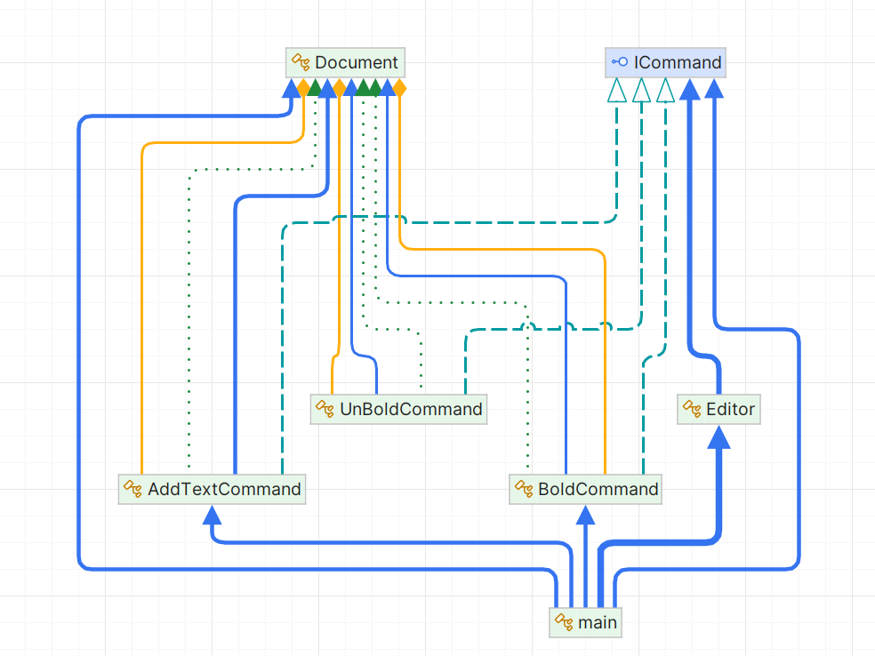

# Command Pattern

## 1. Problem Statement

In collaborative document editing applications, users frequently perform various operations such as typing text, formatting it (bold, italics), inserting images or tables, and undoing or redoing actions. These actions need to be tracked efficiently, allowing users to step through changes (undo) or apply them again (redo). Additionally, handling multiple user actions while keeping track of changes and maintaining an audit trail can become complex.

The system needs to:
- Maintain a history of all actions for undo/redo functionality.
- Track the state of the document after each action (e.g., text, bolding).
- Support complex user interactions with real-time updates for collaborative editing.
- Efficiently apply and revert commands for seamless user experience.

The challenge is to manage these actions and their reversals while ensuring a clean separation of concerns, especially as the system grows in complexity.

## 2. Solution Approach

The **Command Pattern** provides a solution by encapsulating each action (e.g., adding text, bolding text) as a command object. Each command object knows how to execute its action and how to undo it. This decouples the request (e.g., the user action) from the execution, allowing for more flexible control over operations such as undo/redo.

The **Command Pattern** also helps in tracking a history of commands. When a user performs an action, a command is created and stored in a history stack. The application can then execute or undo commands based on user input. For instance, when a user types text, an `AddTextCommand` is created and executed. If the user wants to undo this action, the command can be undone by reversing the text addition.

Commands are independent, meaning that each command can handle a specific action, such as adding text or bolding it, without affecting other operations. This makes the system modular and extensible, as new actions can be added easily by creating new command classes.

## UML Diagram

## 3. Why Command is the Best Approach

The **Command Pattern** is ideal for this situation for the following reasons:

1. **Decoupling of Sender and Receiver**:
    - The Command Pattern decouples the object that sends the request (the user interaction) from the object that performs the action (e.g., the document editing system). This means that the application can handle various actions without needing to tightly bind the logic for execution to the user interface or other components.

2. **Undo/Redo Functionality**:
    - A key benefit of the Command Pattern is the ability to easily implement undo and redo functionality. Each command object knows how to undo its action, which means the system can track the sequence of actions and easily reverse them by calling the `Undo` method on the appropriate command.

3. **Extensibility**:
    - The Command Pattern makes it easy to add new operations. For example, if you want to add a new command to change the font size or insert an image, you simply create a new command class and integrate it into the existing system. This avoids modifying existing code and ensures the system remains flexible.

4. **Centralized Command Management**:
    - The Command Pattern allows for centralized management of all commands. The `Editor` class manages the execution and undoing of commands, which helps keep the application’s logic organized and easier to maintain.

## 4. How Command Eases Life Here

1. **Modular and Maintainable Code**:
    - By encapsulating each action as a command, the code becomes more modular. Each action is encapsulated in its own class, making it easier to manage, extend, and maintain. The system's functionality is divided into separate command objects, making the system more manageable and reducing complexity.

2. **Efficient Undo/Redo Mechanism**:
    - The Command Pattern makes implementing undo/redo functionality simple. By maintaining a stack of executed commands, it’s straightforward to undo or redo actions. Each command knows how to reverse its action, providing an efficient and intuitive way to handle these operations without the need for complex state management.

3. **Separation of Concerns**:
    - The pattern separates the request for an action from the execution of that action. The `Editor` class is responsible for managing the command history and invoking commands, while the commands themselves know how to modify the document. This clear separation helps in making the code more readable and maintainable.

4. **Scalability**:
    - As the system grows and more actions need to be added (e.g., adding images, changing fonts, or applying different styles), the Command Pattern makes it easy to extend the system without modifying existing code. New command classes can be created to handle these new actions, and they can easily be integrated into the existing structure.

5. **Enhanced User Experience**:
    - The Command Pattern allows for efficient handling of user actions in a document editing application. Users can perform multiple actions, and the system ensures that each one is tracked, reversible, and re-applicable. This improves the user experience by offering features like real-time editing, easy undo/redo, and a clear history of changes.

### Conclusion

The **Command Pattern** is a powerful design pattern for managing complex user actions, particularly in scenarios that require undo/redo functionality. In the context of a document editing application, it simplifies the management of document modifications by encapsulating each action as a command. This decouples the logic for executing actions from the rest of the system, making the application more maintainable, extensible, and user-friendly.
