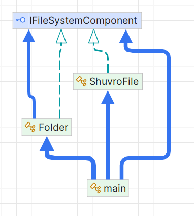

# Composite Pattern

## Problem Scenario

Imagine you're designing a file system where files and folders need to be represented. Folders can contain files as well as other folders, and files cannot contain other files or folders. The goal is to create a flexible and easy-to-use system that can display the hierarchical structure of files and folders.

Without the **Composite Pattern**, you would have to treat files and folders as distinct entities. You would likely create separate classes for files and folders and then implement a separate logic for handling each. This would make it difficult to manage the file system as the number of folders and files grows.

## Solution Approach

The **Composite Pattern** is a structural design pattern that allows you to treat individual objects and compositions of objects uniformly. It is particularly useful when dealing with tree-like structures, where both leaf and composite nodes share the same interface.

### Key Components:

1. **Component Interface (`IFileSystemComponent`)**:
   - This interface defines a method `Display(int indentLevel)`, which will be implemented by both the leaf and composite objects. This allows the client code to treat both files and folders in the same way, making it easier to manage.

2. **Leaf (`ShuvroFile`)**:
   - This class represents a file, which is a leaf node in the composite structure. It implements the `Display` method to show the file's name.

3. **Composite (`Folder`)**:
   - This class represents a folder, which is a composite node. It contains a list of `IFileSystemComponent` objects, allowing it to hold both files and other folders. It also implements the `Display` method to show the folder's name and recursively display the contents inside.

### UML Diagram:



### Flow:
- The `Folder` class can hold both files and other folders, and the `ShuvroFile` class represents the individual files.
- When displaying the file system structure, the `Display` method recursively traverses the hierarchy, printing the names of all files and folders with proper indentation to reflect the hierarchy.

## How This Pattern Makes Life Easier (More Maintainable Code)

1. **Uniform Treatment of Objects**: 
   - The Composite Pattern allows you to treat individual objects (files) and compositions of objects (folders) uniformly. This simplifies the client code because it does not need to differentiate between files and folders when performing operations like displaying the structure.

2. **Extensibility**: 
   - You can easily add new types of components (e.g., different types of files or more complex folders) without modifying the existing code. You simply need to implement the `IFileSystemComponent` interface and include the new component in the existing hierarchy.

3. **Recursive Structure**: 
   - The pattern naturally supports recursive structures (like a folder containing other folders), making it easy to represent tree-like data. This is especially useful when dealing with hierarchical systems, like file systems.

4. **Flexible Hierarchy**:
   - The structure can grow or change dynamically. You can add or remove files or folders at any level without disrupting the overall system. Each component (file or folder) is responsible for its own behavior, making the code more maintainable and adaptable.

5. **Simplified Client Code**: 
   - The client code can interact with files and folders through the common interface `IFileSystemComponent`, eliminating the need for conditional checks to handle files and folders separately. This makes the code simpler and cleaner.

### Example Output

```text
File System Structure:
[folder] : RootFolder
    [folder] : Folder1
        [file] : Document1.txt
        [file] : Image1.jpg
    [folder] : Folder2
        [file] : Document2.txt
        [folder] : Folder3
            [file] : Image2.jpg
            [file] : Document3.txt
```

### Conclusion

The **Composite Pattern** allows you to manage complex hierarchical structures by treating individual objects and their compositions in a uniform way. In the case of a file system, both files and folders are treated as `IFileSystemComponent` objects, simplifying the client code and making the system easier to maintain and extend. This pattern is particularly useful for working with tree-like structures, where objects can be nested inside other objects, and operations on them can be standardized.
