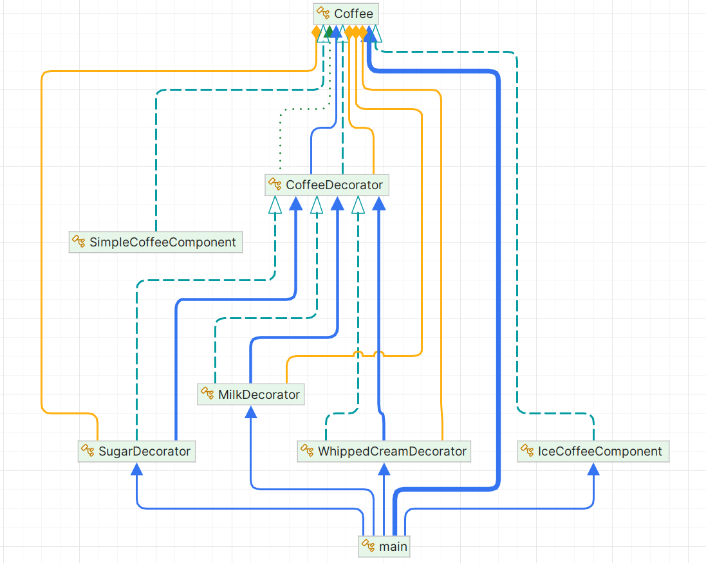

# Decorator Pattern

## Problem Scenario

Imagine you're building a coffee shop application where customers can order coffee with various customizations. The basic coffee can be enhanced by adding ingredients such as milk, sugar, or whipped cream. Each customization should not modify the basic coffee object itself but should add behavior on top of it.

Without the Decorator Pattern, you would need to subclass `Coffee` for every possible combination of customizations (e.g., `MilkCoffee`, `SugarCoffee`, `MilkSugarCoffee`, etc.), leading to a combinatorial explosion of classes.

## Solution Approach

The **Decorator Pattern** is a structural design pattern that allows you to dynamically add behavior or responsibilities to an object. Instead of creating a new subclass for each combination of customizations, we create decorators that wrap the original object (in this case, `Coffee`) and add the extra functionality.

### UML Diagram

### Key Components:

1. **Base Component (`Coffee`)**:
    - This is an abstract class that defines the essential methods (`Brew` and `Cost`) that will be shared across all coffee types.

2. **Concrete Component (`SimpleCoffee`)**:
    - This class represents a basic coffee without any customizations. It implements the abstract methods and provides default behavior.

3. **Decorator (`CoffeeDecorator`)**:
    - This is an abstract class that extends the `Coffee` class and contains a reference to a `Coffee` object. The decorator forwards method calls to the wrapped `Coffee` object and can add additional behavior.

4. **Concrete Decorators (`MilkDecorator`, `SugarDecorator`, `WhippedCreamDecorator`)**:
    - These decorators add specific functionalities (like milk, sugar, or whipped cream) to the base coffee object by overriding the `Brew` and `Cost` methods.

### Flow:
- The client code starts with a basic coffee object (`SimpleCoffee`) and then decorates it step-by-step by wrapping it with different decorators (`MilkDecorator`, `SugarDecorator`, etc.).
- The decorators modify the behavior of the original object without altering its structure, offering flexibility for future customizations.

## How This Pattern Makes Life Easier (More Maintainable Code)

1. **Open/Closed Principle**:
    - The Decorator Pattern follows the Open/Closed Principle (OCP), which means that the code is open for extension but closed for modification. Instead of modifying existing classes, you can extend the functionality by creating new decorators. This makes your codebase more flexible and easier to extend without modifying existing code.

2. **Avoids Class Explosion**:
    - If we were to create a subclass for every possible combination of customizations (e.g., `MilkCoffee`, `SugarCoffee`, etc.), we would end up with an unmanageable number of classes. The Decorator Pattern helps us avoid this "class explosion" by using a single decorator for each customization and applying them in combination as needed.

3. **Better Code Reusability**:
    - Decorators are reusable across different components. You can apply them to any `Coffee` object, whether it's a simple coffee or another type of decorated coffee. This helps you avoid code duplication and makes the system more maintainable.

4. **Enhances Flexibility**:
    - The pattern allows for a high level of flexibility as you can combine multiple decorators in different orders. This means that each time the program runs, it can create different coffee combinations dynamically.

5. **Single Responsibility**:
    - Each decorator is responsible for only one additional feature (milk, sugar, whipped cream), which keeps the code more modular and easier to maintain or extend.

### Conclusion

The **Decorator Pattern** is an excellent way to dynamically add behavior to objects without altering their base structure. By using this pattern, we avoid subclassing and allow for easy customization and extension of the functionality. It makes your code more maintainable, flexible, and adheres to best practices like the Open/Closed Principle.
