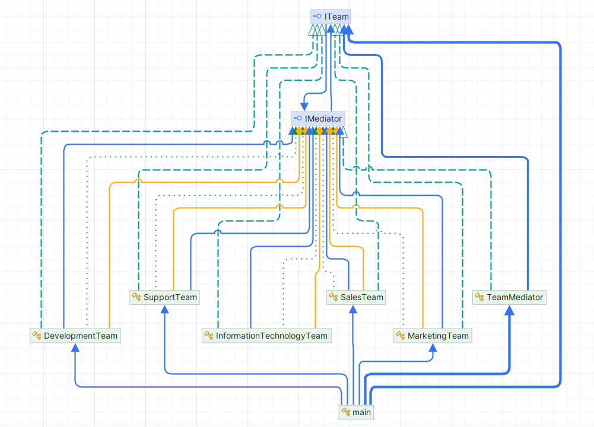

# Mediator Pattern

## 1. Problem Statement

In an organization, different teams (e.g., Marketing, Sales, IT, Development, Support) often need to communicate and collaborate with each other to accomplish common goals. However, if each team directly communicates with every other team, it can lead to a tangled web of interactions and dependencies, making the communication process complex and inefficient.

For example, the marketing team may need to communicate with the development team for a new feature, while the sales team needs to interact with the support team for customer issues. As the organization grows, the number of interactions between teams increases, leading to confusion, duplication of messages, and possible communication breakdowns.

This creates the problem of managing multiple inter-team communications effectively and ensuring that messages are directed appropriately without overloading any team.

## UML Diagram

## 2. Solution Approach

The **Mediator Pattern** provides a solution by centralizing communication between objects (in this case, teams) through a mediator. Instead of teams communicating directly with each other, they send messages to a mediator that handles the message routing. The mediator is responsible for ensuring that each team gets the necessary messages and facilitates communication between them.

In this scenario, the **TeamMediator** acts as the central mediator that registers all the teams and handles message routing. Teams such as Marketing, Sales, Development, Support, and IT communicate with each other through the mediator, ensuring that messages are directed to the appropriate teams. This reduces the direct dependencies between teams and simplifies the communication process.

## 3. Why Mediator is the Best Approach

The **Mediator Pattern** is ideal for this situation for the following reasons:

1. **Centralized Control**:
    - The mediator centralizes communication, making it easier to manage interactions between teams. Instead of handling direct communication between multiple teams, all interactions go through the mediator, which improves the organization of communication.

2. **Reduced Complexity**:
    - Without the mediator, teams would need to be aware of the other teams they need to communicate with, creating a complex network of dependencies. By using the mediator, teams only need to know how to communicate with the mediator, not with each other, reducing the complexity of communication.

3. **Decoupling Teams**:
    - The Mediator Pattern decouples the teams from each other. Teams no longer need to be aware of the internal workings or the existence of other teams. They only interact with the mediator, which makes the system more flexible and easier to maintain.

4. **Easier Maintenance and Extensibility**:
    - As new teams are added to the system, the mediator can easily register them and handle their communication. There’s no need to change the communication logic between the existing teams. This makes it easier to extend the system without affecting the existing team interactions.

## 4. How Mediator Eases Life Here

1. **Simplifies Communication**:
    - The mediator simplifies communication between teams. Teams no longer need to communicate directly with every other team. Instead, they simply send messages through the mediator, which handles the routing of messages to the correct recipients. This reduces the complexity of direct team-to-team communication.

2. **Reduces Dependencies**:
    - By using the mediator, teams do not have direct dependencies on each other. This means that the system can be more flexible, and teams can be added or removed without affecting others. Changes to one team's internal communication don’t affect others as long as the mediator’s interface remains consistent.

3. **Improves Collaboration**:
    - With the mediator in place, each team can focus on its own tasks and only communicate when necessary. The mediator ensures that the appropriate teams are notified when needed, facilitating smooth collaboration and reducing unnecessary interactions.

4. **Facilitates Efficient Message Handling**:
    - The mediator makes sure that messages are only sent to relevant teams, avoiding message overload. When a team sends a message, the mediator routes it to all other teams except the sender. This makes the communication flow more efficient and prevents unnecessary notifications to the sender.

5. **Organizes Complex Interactions**:
    - In larger organizations with many teams, interactions can become complicated. The mediator organizes these interactions, ensuring that messages are routed in an orderly manner, and preventing any team from becoming overwhelmed by redundant or irrelevant messages.

### Conclusion

The **Mediator Pattern** simplifies and organizes communication in complex systems, such as an organization with multiple teams. By using a mediator to centralize interactions, teams are decoupled from each other, reducing dependencies and complexity. This results in a more maintainable, extensible, and efficient communication structure that eases the management of inter-team relationships.
