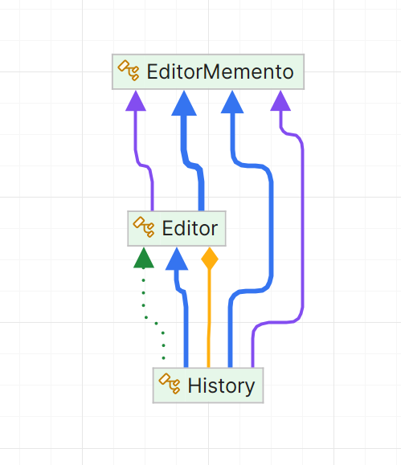

# Memento Pattern

## 1. Problem Statement

In a document editor application, users frequently make changes to the document, such as inserting, deleting, or selecting text. Sometimes, users may want to undo their actions, such as reversing an insertion or restoring a previously selected portion of text. Managing these actions and tracking the document's state becomes complicated when dealing with complex interactions in the editor.

Additionally, as the user makes changes, it’s necessary to maintain a history of the document’s state, allowing for efficient undo/redo functionality. However, storing and managing the full history of the document with all its changes (text, cursor position, and selection) in a way that is easy to restore can quickly become cumbersome.

The challenge is to provide a simple way to track the editor's state over time, store it efficiently, and restore previous states on request.

## UML Diagram

## 2. Solution Approach

The **Memento Pattern** provides a solution to this problem by allowing the system to capture and store the internal state of an object (in this case, the document editor) without exposing its details. The **Editor** object (the originator) creates a snapshot of its current state (text, cursor position, and selection) and stores it in a **Memento** object.

This pattern separates the responsibilities of the document editor and its history management:
- The **Editor** creates and restores its state using the Memento.
- The **History** class acts as the caretaker, storing and managing the mementos (snapshots) of the document’s state.

The Memento Pattern enables efficient undo/redo functionality by allowing the document's state to be saved and restored at various points in time, without exposing the internal structure of the editor. This ensures that the editor can revert to any previously saved state when needed.

## 3. Why Memento is the Best Approach

The **Memento Pattern** is the best approach for this scenario for several reasons:

1. **Encapsulation**:
    - The Memento Pattern encapsulates the state of an object, meaning that the **Editor** does not need to expose its internal state (e.g., text, cursor position, selection) to the outside world. Only the **Memento** knows how to store the state, ensuring that the **Editor** maintains control over its data.

2. **Undo/Redo Support**:
    - The Memento Pattern is ideal for implementing undo and redo functionality. Each change to the document can be captured as a **Memento** object, allowing the system to store and restore the document's state efficiently. When a user requests an undo, the editor simply restores the last memento, which takes it back to the previous state.

3. **Separation of Concerns**:
    - By using the Memento Pattern, the **Editor** focuses solely on modifying the document, while the **History** class manages the snapshots. This separation of concerns keeps the code clean, modular, and easier to maintain. The editor doesn’t need to worry about managing its history, which is handled by the caretaker class.

4. **Efficiency**:
    - The Memento Pattern allows the document's state to be stored efficiently as small snapshots, making it easy to restore the document to any previous state without having to recompute or reapply all changes.

## 4. How Memento Eases Life Here

1. **Efficient Undo/Redo Operations**:
    - The Memento Pattern makes it easy to implement undo and redo functionality. Each action taken by the user (e.g., inserting text, deleting text, moving the cursor) is captured as a memento. The **History** class manages these mementos and allows the editor to revert to any previous state, giving the user a smooth experience when navigating through changes.

2. **Modular and Clean Design**:
    - The pattern promotes a clean design by separating the responsibilities of modifying the document and managing its history. The **Editor** is responsible for managing the document’s content, while the **History** is solely responsible for saving and restoring document states. This modular design makes it easier to maintain and extend the system.

3. **Easy State Management**:
    - With the Memento Pattern, managing and restoring the state of the document is simplified. The document's state is stored as a single object (the **Memento**) that can be passed around and restored whenever necessary. This allows for efficient tracking of the document’s state over time.

4. **Persistent History**:
    - The pattern enables the persistence of the document's history. In addition to storing mementos in memory for immediate undo/redo functionality, the system can serialize these mementos into files (such as JSON) for later use. This allows the user to save and restore their document state even after the application is closed and reopened.

5. **Improved User Experience**:
    - With efficient undo and redo operations, users can easily navigate through their document editing history. They can experiment with changes, and if something goes wrong, they can quickly revert to the last known good state. This improves the overall user experience, as users feel more in control of their document.

### Conclusion

The **Memento Pattern** provides a simple and effective way to manage undo and redo functionality in a document editor. By separating the responsibilities of editing and history management, it ensures that the system is clean, modular, and easy to maintain. The pattern also improves the user experience by enabling efficient state tracking and restoration, allowing users to easily navigate their document changes.
