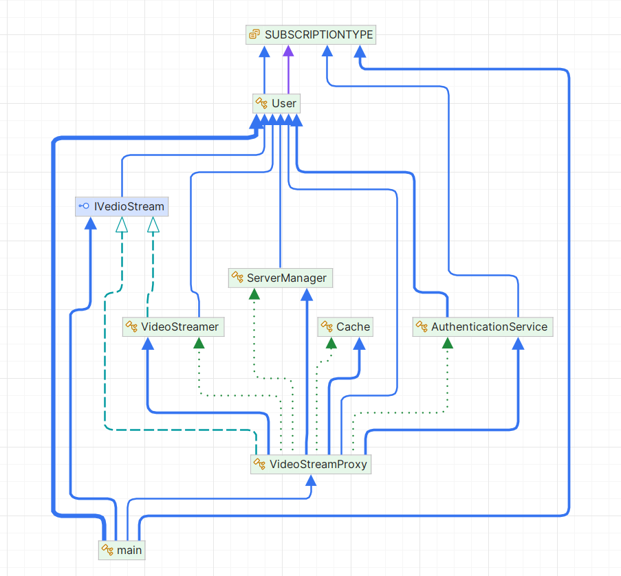

# Proxy Pattern

## 1. Problem Statement

In modern video streaming services, there are multiple factors to consider before streaming content to users, such as authentication, subscription type (premium or standard), access control, caching, and server management. Without an efficient system, each of these steps could result in performance bottlenecks or a poor user experience. For example, every time a video is requested, the system might need to authenticate the user, check their subscription, fetch the video from a server, and cache it for future use.

Handling all of these tasks each time a user requests a video can be inefficient, especially if some tasks (like checking access or fetching a video) are repetitive. Additionally, streaming directly from the server every time could lead to delays and unnecessary resource consumption.

## UML Diagram

## 2. Solution Approach

The **Proxy Pattern** is used to solve this problem by providing a surrogate or placeholder for the real video streaming service. The proxy handles the common tasks such as authentication, access control, caching, and server management, allowing the real video streaming service to focus only on streaming the video.

In this case, the **VideoStreamProxy** acts as a mediator between the user and the real video streaming service. It checks if the user is authenticated, verifies if they have access to the requested content based on their subscription, retrieves the video from cache if available, and if not, fetches it from an optimal server. This reduces the workload of the real streaming service and optimizes the user experience by caching videos for future use and avoiding redundant operations.

## 3. Why Proxy is the Best Approach

The **Proxy Pattern** is ideal for this situation for the following reasons:

1. **Performance Optimization**:
    - The proxy minimizes the load on the real video streaming service by handling common tasks like authentication, access control, and caching before delegating the video streaming to the real service. This reduces unnecessary interactions with the server and improves the overall performance of the system.

2. **Access Control**:
    - The proxy ensures that only authenticated users with the appropriate subscription type can access the video content. It serves as a gatekeeper, providing an additional layer of security and access control without requiring changes to the core video streaming logic.

3. **Caching**:
    - The proxy handles caching of videos for future requests, ensuring that the system doesn't need to stream the same video repeatedly. This reduces server load and improves response times for repeated requests, making the user experience smoother and faster.

4. **Separation of Concerns**:
    - By using a proxy, the responsibilities of authentication, access control, caching, and server management are separated from the core functionality of video streaming. This makes the system more modular and easier to maintain, as changes to any of the auxiliary functionalities (such as authentication or caching) can be made in the proxy without affecting the real video streaming service.

## 4. How Proxy Eases Life Here

1. **Reduced Redundancy**:
    - The proxy handles the repetitive tasks of checking authentication, access control, and caching. By managing these concerns upfront, the real video streaming service only focuses on the essential task of streaming videos, eliminating the need for repetitive checks and logic.

2. **Improved User Experience**:
    - By checking the cache before fetching the video from the server, the proxy ensures faster video delivery. This is especially beneficial for users who frequently request the same videos, as the system can serve them instantly from the cache rather than re-streaming the video each time.

3. **Simplified Access Control**:
    - The proxy ensures that users with different subscription types (e.g., standard and premium) can only access content they are allowed to view. This is handled transparently, making it easier to implement and enforce access control without cluttering the core video streaming code.

4. **Seamless Interaction**:
    - Users do not need to interact with the proxy directly. They simply request videos, and the proxy ensures that all tasks such as authentication, access control, and caching are handled automatically. This makes the system easier to use and reduces the chances of errors or unexpected behavior.

5. **Easier System Maintenance**:
    - The proxy decouples the auxiliary services (such as authentication, caching, and server management) from the core video streaming logic. This makes the system easier to extend, as any changes to how videos are authenticated or served can be made within the proxy without affecting the video streaming functionality.

### Conclusion

The **Proxy Pattern** is an effective design pattern when there is a need to control access to a resource or service, optimize performance, or handle additional responsibilities (like caching or access control) without affecting the core logic. In this case, the **VideoStreamProxy** improves the performance, security, and scalability of the video streaming service by managing auxiliary tasks, which results in a better and more efficient user experience.
