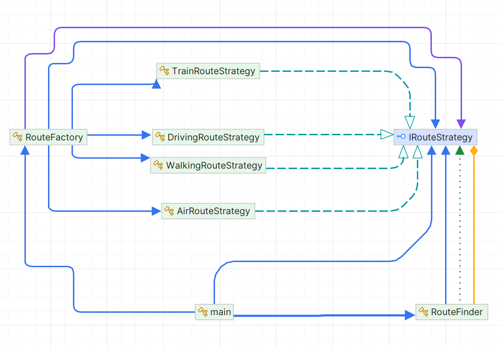

### Problem Scenario: Implementing the Strategy Pattern in C#

You are working on a C# project that requires implementing the Strategy Pattern to handle different algorithms for a specific task. The goal is to define a family of algorithms, encapsulate each one, and make them interchangeable. The Strategy Pattern allows the algorithm to vary independently from the clients that use it.

### Requirements:
1. **Context Class**: A class that uses a Strategy to perform a task.
2. **Strategy Interface**: An interface that defines the algorithm's method.
3. **Concrete Strategies**: Multiple classes that implement the Strategy interface with different algorithms.

### Example Scenario:
You are developing a route finding system that supports multiple route methods (e.g., Driving Route, Air Route, Train Route, Walking Route). Each route method has a different algorithm for finding the best route. You need to implement the Strategy Pattern to handle these different algorithms in a flexible and maintainable way.

### UML Diagram


### Steps to Implement:

1. **Define the Strategy Interface**:
    ```csharp
    public interface IRouteStrategy
    {
        void Execute();
    }
    ```

2. **Implement Concrete Strategies**:
    ```csharp
    public class AirRouteStrategy : IRouteStrategy
    {
        public void Execute()
        {
            Console.WriteLine("Calculating air route...");
        }
    }

    ...
    ```

3. **Create the Context Class**:
    ```csharp
    public class RouteContext
    {
        private IRouteStrategy _routeStrategy;

        public void SetRouteStrategy(IRouteStrategy routeStrategy)
        {
            _routeStrategy = routeStrategy;
        }

        public void FindRoute()
        {
            _routeStrategy.Execute();
        }
    }
    ```

This scenario shows how to use the Strategy Pattern to handle different route algorithms in a route finding system. By implementing the Strategy Pattern, you can easily switch between different route methods without changing the client code.

> Note : Program class is the part of client code which is using the strategy pattern to find the route. so it can have `if...else` or `switch` case to select the strategy at runtime.