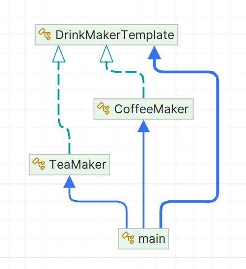

# Template Method Pattern

## Problem Statement

Imagine you're designing a system for making hot beverages, like **tea** and **coffee**. The general process for making any hot beverage involves similar steps:

1. Boil water
2. Brew the beverage (tea or coffee)
3. Pour into a cup
4. Add condiments (like sugar, milk, or lemon)
5. Serve

However, the steps for brewing and adding condiments differ between beverages. For example:
- When making **tea**, you steep the tea leaves, and you might add lemon.
- When making **coffee**, you drip the coffee through a filter, and you might add sugar and milk.

Now, you want to make sure that all beverages follow the same general steps but allow the brewing and condiments part to vary based on the type of beverage.

---

## UML Diagram


## Solution Approach

The **Template Method Pattern** is a behavioral design pattern that defines the skeleton of an algorithm in a method, called the **template method**, which allows subclasses to redefine certain steps of the algorithm without changing its structure.

### Key Concepts:
1. **Abstract Class**: This class defines the general steps of the algorithm (in this case, the process of making a beverage), where some steps are defined while others are abstract and must be implemented by subclasses.
2. **Concrete Subclasses**: These are responsible for implementing the varying parts of the algorithm (brewing the tea or coffee and adding condiments).

### How the Template Method Works:
- The **DrinkMakerTemplate** class provides the template method `MakeDrink()`, which executes the steps for making any beverage in a fixed order.
- The steps of boiling water, pouring into a cup, and serving are common for all drinks, so they are implemented in the **abstract class**.
- The steps for brewing the beverage and adding condiments are abstract methods, meaning that each subclass (like **CoffeeMaker** or **TeaMaker**) provides its own implementation of these steps.

### The Structure:

1. **Abstract Class (`DrinkMakerTemplate`)**:
    - Defines common steps (`BoilWater`, `PourInCup`, `Serve`) that are shared across all beverages.
    - Contains abstract methods (`Brew`, `AddCondiments`) that must be implemented by subclasses to handle specific details of brewing and condiments.

2. **Concrete Subclasses (`CoffeeMaker`, `TeaMaker`)**:
    - Implement the abstract methods `Brew` and `AddCondiments` according to the specifics of making tea or coffee.


### Expected Output:

```
Boiling water...
Brewing coffee...
Pouring in cup...
Adding sugar and milk...
Serving...

Boiling water...
Steeping the tea...
Pouring in cup...
Adding lemon...
Serving...
```

## Justification for Using Template Method Pattern

1. **Code Reusability**: By defining common steps in the abstract class, we eliminate the need to repeat them in each subclass. This reduces code duplication, making the system easier to maintain.

2. **Flexibility**: The template method enforces a consistent algorithm while allowing subclasses to customize specific steps (like brewing and condiments). This is ideal for cases where the general process is the same but individual steps can vary.

3. **Control Over Algorithm**: The template method ensures that the core structure of the algorithm (making a beverage) is fixed, preventing any subclass from altering the fundamental process. Subclasses are only allowed to implement the details, ensuring consistency in the final outcome.

4. **Encapsulation**: The abstract class hides the implementation details of common steps and only exposes the `MakeDrink` method to the client, ensuring that users cannot accidentally disrupt the order or logic of the process.


### Conclusion

The **Template Method Pattern** is an essential design pattern when you need to define a general structure for an algorithm but allow for specific details to be customized. In the context of making beverages, the pattern ensures consistency in the overall process while allowing the flexibility to adapt to different types of drinks (like tea and coffee). This design pattern helps in reducing redundancy, improving maintainability, and ensuring that the correct steps are always followed.