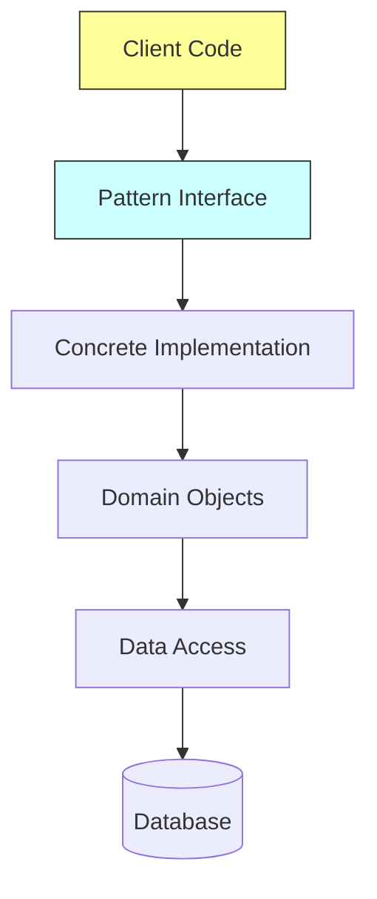

# 🏗️ C# Design Patterns Compendium - Architectural Excellence Catalog


**A living encyclopedia of Gang of Four design patterns** implemented with modern C# practices, real-world use cases, and architectural insights. Perfect for engineers, architects, and CS educators!

## 🌟 Why This Repository?

✅ **Production-Grade Examples** - Not just toy code!  
✅ **Pattern Interrelationships** - See how patterns combine   
✅ **Time-Stamped Evolution** - Track file lifecycle metadata  
✅ **Scenario-Based Learning** - eCommerce, IoT, SaaS case studies

---

## 🧭 Navigation Guide

### 🔀 Behavioral Patterns
| Pattern | Key Concept | Example Implementation | Docs |
|---------|-------------|-------------------------|------|
| **Command** | Encapsulate requests | [Undo/Redo Editor](CommandPattern/) | [📚](CommandPattern/readme.md) |
| **Mediator** | Centralized control | [Team Collaboration](MediatorPattern/) | [📚](MediatorPattern/readme.md) |
| **Observer** | Event-driven systems | [Smart Home Automation](ObserverPattern/) | [📚](ObserverPattern/readme.md) |
| **Strategy** | Runtime algorithm swap | [Route Navigation](StrategyPattern/) | [📚](StrategyPattern/readme.md) |
| *8 more...* | | | |

### 🏗️ Structural Patterns
| Pattern | Key Concept | Example Implementation | Docs |
|---------|-------------|-------------------------|------|
| **Adapter** | Interface bridge | [Payment Gateways](AdapterPattern/) | [📚](AdapterPattern/readme.md) |
| **Composite** | Tree structures | [File System](CompositePattern/) | [📚](CompositePattern/readme.md) |
| **Decorator** | Dynamic wrappers | [Coffee Customization](DecoratorPattern/) | [📚](DecoratorPattern/readme.md) |
| **Proxy** | Controlled access | [Video Streaming](ProxyPatterm/) | [📚](ProxyPatterm/readme.md) |
| *5 more...* | | | |

### 🏭 Creational Patterns
| Pattern | Key Concept | Example Implementation | Docs |
|---------|-------------|-------------------------|------|
| **Singleton** | Global access | [Factorial Cache](SingletonClassPattern/) | [📚](SingletonClassPattern/readme.md) |
| **Factory Method** | Object creation | [Route Strategies](FactoryMethodPattern/) | [📚](FactoryMethodPattern/readme.md) |
| **Abstract Factory** | Families of objects | *Coming Soon* | |

---

## 🧬 Pattern Implementation Highlights

### 🔑 Unique Features
- **Real-World Scenarios**  
  Each pattern solves actual industry problems:
  ```csharp
  // Facade Pattern in Smart Home
  var homeFacade = new HomeSystemFacade();
  homeFacade.StartMovieMode(); // Handles lights, temp, security
  ```

- **Automated Structure Generation**  
  Our Python script [data.py](data.py) auto-generates:
  ```python
  # Sample generation logic
  create_folder_structure(
      pattern_name="Observer",
      components=["Core", "Models", "Executor"],
      files=["EnvironmentState.cs", "PowerConsumptionData.cs"]
  )
  ```

- **Cross-Pattern Integration**  
  See how patterns combine:
  ```
  Command + Memento = Undo/Redo Stack
  Strategy + Factory = Runtime Algorithm Selection
  ```

---

## 🛠️ Developer Workspace Setup

### Prerequisites
- .NET 6 SDK
- IDE: Visual Studio 2022+ / Rider / VSCode
- Python 3.8+ (for structure generation)

### Build & Run
```bash
# Clone with submodules
git clone --recurse-submodules https://github.com/sakhadib/Design-Patterns.git

# Restore dependencies
dotnet restore DesignPatterns.sln

# Run specific pattern
cd AdapterPattern
dotnet run
```

### IDE Configuration
1. Enable solution-wide analysis
2. Install C# Dev Kit for VSCode
3. Set up EditorConfig rules


---

## 📚 Learning Resources

### Bookshelf
- "Design Patterns: Elements of Reusable Object-Oriented Software" (Gang of Four)
- "Head First Design Patterns" by Eric Freeman
- "C# in Depth" by Jon Skeet

### Interactive Learning
- [Refactoring.Guru Patterns](https://refactoring.guru)
- [Pluralsight C# Path](https://pluralsight.com)
- [Microsoft Learn OOP](https://learn.microsoft.com)

---

## 🤝 Contribution Framework

### Code Standards
- Follow C# 10 conventions
- XML documentation mandatory
- Test-Driven Development (TDD) encouraged

### Workflow
1. Fork repository
2. Create feature branch: `feat/command-pattern-enhance`
3. Implement changes
4. Update [data.py](data.py) if modifying structure
5. Submit PR with pattern documentation

### Issue Labels
| Label | Purpose |
|-------|---------|
| `Pattern Proposal` | New pattern suggestions |
| `Architecture` | Structural discussions |
| `Bug - Logical` | Implementation errors |
| `Enhancement` | Pattern improvements |

---

## 🏛️ Architectural Philosophy



**Core Principles:**
1. SOLID Compliance
2. Layer Separation
3. Testability First
4. Documentation-Driven
5. Performance Awareness

---

## 📜 License & Attribution

MIT License - Free for educational and commercial use. Attribution appreciated but not required.

**Notable Influences:**
- Gang of Four original patterns
- Microsoft .NET Architecture Guides
- Clean Architecture by Robert C. Martin

---

> "Patterns are not solutions, they're **solution frameworks** - the art lies in their contextual application."  
> - sakhadib